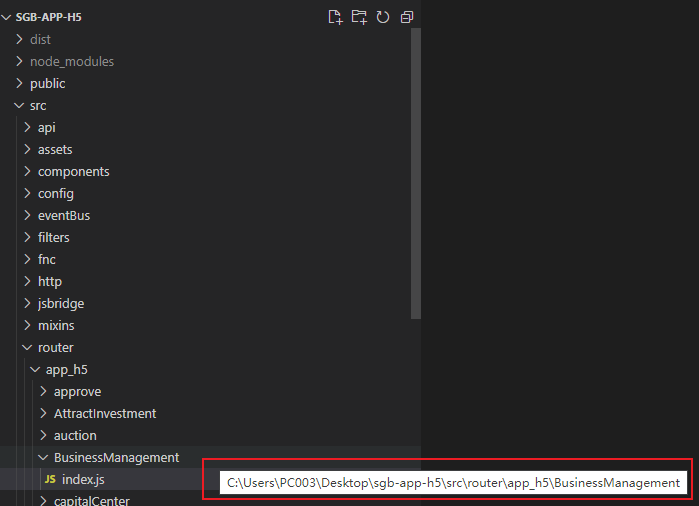

## 介绍

-根据你所提供的router对象，自动地创建对应页面文件目录以及.vue组件文件,不支持路由嵌套生成

-筛选query参数，只支持query.xxx匹配
#### 基础
在项目根目录下创建一个配置文件rfc.config.js，内容示例如下：
```javascript
module.exports = {
    baseUrl:`C:\Users\PC003\Desktop\demo\src\router\app_h5\BusinessManagement`,
    baseWriteUrl:`C:\Users\PC003\Desktop\demo\src`
}
```
####其中：
- baseUrl: 是你输出router对象的目录，也就是index.js的文件绝对路径
- baseWriteUrl: 文件创建的基准地址，相当于下边的@的绝对路径
- baseWriteUrl+@/views/app_h5/BusinessManagement/websiteHonorDetail.vue 组成完成路径

### 运行命令
打开终端，在根目录下运行
```javascript
//生成文件
rfc vue
//抽取参数 在目标位置生成1.txt文件
rfc txt
```


